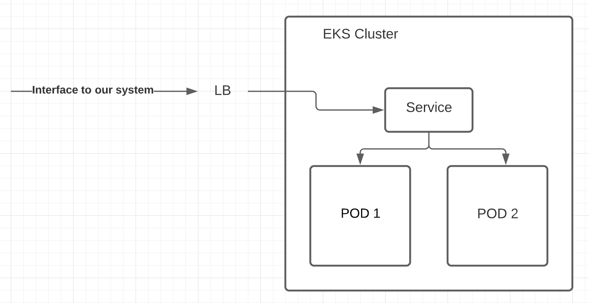

# Xeneta Operations Task

The task is two-fold:

* A practical case of developing a deployable development environment based on a simple application.

* A theoretical case describing and evolving a data ingestion pipeline.

You will be expected to present and discuss both solutions.

Some general points:

* **Provide the solution as a public git repository that can easily be cloned by our development team.**

* Provide any instructions needed to run the automation solution in `README.md`.

* The configuration file `rates/config.py` has some defaults that will most likely change depending on the solution. It would be beneficial to have a way to more dynamically pass in config values.

* List and describe the tool(s) used, and why they were chosen for the task.

* If you have any questions, please don't hesitate to contact us.

## Practical case: Deployable development environment

### Premise

Provided are two simplified parts of the same application environment: A database dump and an API service. Your task is to automate setting up the development environment in a reliable and testable manner using "infrastructure as code" principles.

The goal is to end up with a limited set of commands that would install the different environments and run them using containers. You can use any software that you find suitable for the task. The code should come with instructions on how to run it and deploy it to arbitrary targets; whether it is deployed locally, towards physical machines, or towards virtual nodes in the cloud.

### Running the database

There’s an SQL dump in `db/rates.sql` that needs to be loaded into a PostgreSQL 13.5 database.

After installing the database, the data can be imported through:

```
createdb rates
psql -h localhost -U postgres < db/rates.sql
```

You can verify that the database is running through:

```
psql -h localhost -U postgres -c "SELECT 'alive'"
```

The output should be something like:

```
 ?column?
----------
 alive
(1 row)
```

### Running the API service

Start from the `rates` folder.

#### 1. Install prerequisites

```
DEBIAN_FRONTEND=noninteractive apt-get update && apt-get install -y python3-pip
pip install -U gunicorn
pip install -Ur requirements.txt
```

#### 2. Run the application
```
gunicorn -b :3000 wsgi
```

The API should now be running on [http://localhost:3000](http://localhost:3000).

#### 3. Test the application

Get average rates between ports:
```
curl "http://127.0.0.1:3000/rates?date_from=2021-01-01&date_to=2021-01-31&orig_code=CNGGZ&dest_code=EETLL"
```

The output should be something like this:
```
{
   "rates" : [
      {
         "count" : 3,
         "day" : "2021-01-31",
         "price" : 1154.33333333333
      },
      {
         "count" : 3,
         "day" : "2021-01-30",
         "price" : 1154.33333333333
      },
      ...
   ]
}
```


##Answer 

####Pre-requisite software
1. Docker
2. Docker-compose

I have taking this problem that mostly developer face while dong 
testing and coding on their local machines as it was mentioned we 
need to implement Deployable development environment.


You can execute the following command to deploy the both API server
and postgresql on your machine.

```bash
docker-compose up --build
```

Applicaiton can be build and tested without restarting any container because code 
directory is been mounted to the container.

## Case: Data ingestion pipeline

In this section we are seeking high-level answers, use a maximum of couple of paragraphs to answer the questions.

### Extended service

Imagine that for providing data to fuel this service, you need to receive and insert big batches of new prices, ranging within tens of thousands of items, conforming to a similar format. Each batch of items needs to be processed together, either all items go in, or none of them do.

Both the incoming data updates and requests for data can be highly sporadic - there might be large periods without much activity, followed by periods of heavy activity.

High availability is a strict requirement from the customers.

* How would you design the system?
* How would you set up monitoring to identify bottlenecks as the load grows?
* How can those bottlenecks be addressed in the future?

Provide a high-level diagram, along with a few paragraphs describing the choices you've made and what factors you need to take into consideration.


### Answer



#####1. AutoSacling Group:
We will be cotrolling autoscaling at instance level using Autoscaling group.

#####2. HPA(Horizontal Pod Autoscaler):
POD Level autoscaling can be controlled by HPA setting on 60% of Mem and CPU which can be 
monitored configurng metrics server in kubernetes kube-system namespace. kube-system NS will
make it available to all other namespaces if we are usnig different namespaces for every 
different environment.


#####3. Monitoring
* We can setup an alert on maximum # node count set for our Auto scaling group.
  * So that we can increase the limit in case we reach to the max node limit unexectedly.
* We can setup monitoring alerts on our containers using  Newrelic whenever it fails to start more than 10 times in 5 minute.
  * It will help us to analyse thr actual problem at the right time before it gets late. Or someone 
   silence it by manual intervention.
* We can also ship our API service container logs to S3 and to Newrelic in order to use NRQL to query the logs.
  * S3 logs can be used to improve our system on the basis of historical logs, and also Newrelic  provide accessibility 
  to only last 30 days logs.
  * If you have maintained historical logs in a good and partitioned way you can query them using Any tool, like, AWS Athena or it can be read through Spark application.
  * Why we would need that? Because time may come you would like to check query logs based on any id found which may belong to any non ethical hacker. In this way, we can trace damage to our system in this way. 
  That was the only possible solution.
* If load grows and we reach to the max limit of our nodes, we can simply increase the max node value in our scaling group. 
  

### Additional questions

Here are a few possible scenarios where the system requirements change or the new functionality is required:

1. The batch updates have started to become very large, but the requirements for their processing time are strict.

2. Code updates need to be pushed out frequently. This needs to be done without the risk of stopping a data update already being processed, nor a data response being lost.

3. For development and staging purposes, you need to start up a number of scaled-down versions of the system.

Please address *at least* one of the situations. Please describe:

- Which parts of the system are the bottlenecks or problems that might make it incompatible with the new requirements?
- How would you restructure and scale the system to address those?


### Answer 
1. So at this stage we can start using Multithreaading solution, like ThreadPool. This way we can distribute our batch load to 
smaller batch and it will increase our speed.  
    * We can also think about using Distributed processing framework like, spark if our data traits goes toward the Big Data 5 Vs.
2. Second point simply point towards the TerminationGracePeriodSecond and PreStop hook property of the pods.
3. We write code for our infrastructure with different parameters file. For instance, For staging and development we will be using 
2 different parameter files and for production it wil be a separate one. 
    * For example, we have one cloudformation template to deploy our base_infra named as base_infra.yaml. We will maintain all the code in one template
    but to set it according to different environment's specificaiton, we will have three paramters file for this base_infrs.yaml template named as follow:
        * development_base_infra_params.yaml
        * staging_base_infra_params.yaml
        * prod_base_infra_params.yaml


######Which parts of the system are the bottlenecks or problems that might make it incompatible with the new requirements?

To handle Bigger batch with the atomicity(ACID property) on batch level can be hard to achieve. And specially with Multithreading solution it can be way much harder than the single threaded solution.

######My Remedy
I would introduce Spark to handle Bigger batch(having tens of thousands of records) using transactional writes of Spark. 
Reference: https://andriymz.github.io/spark/transactional-writes-in-spark/#transactional-writes